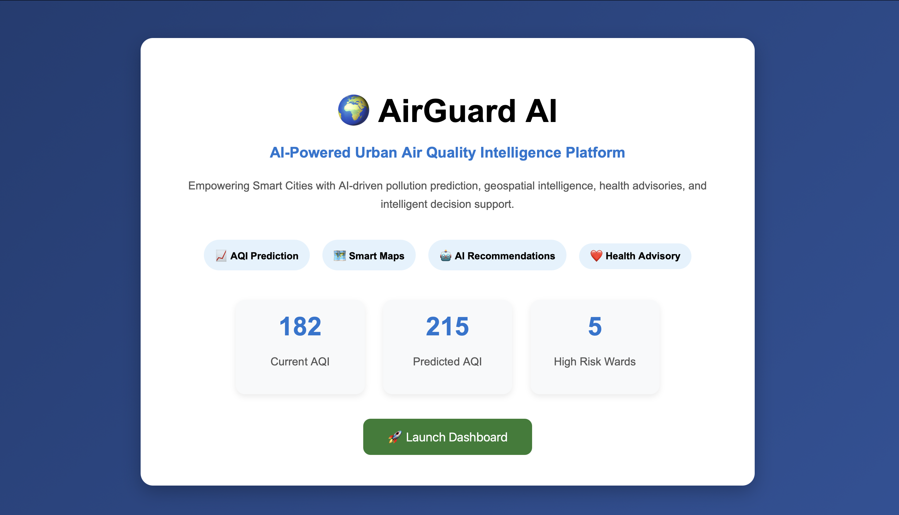
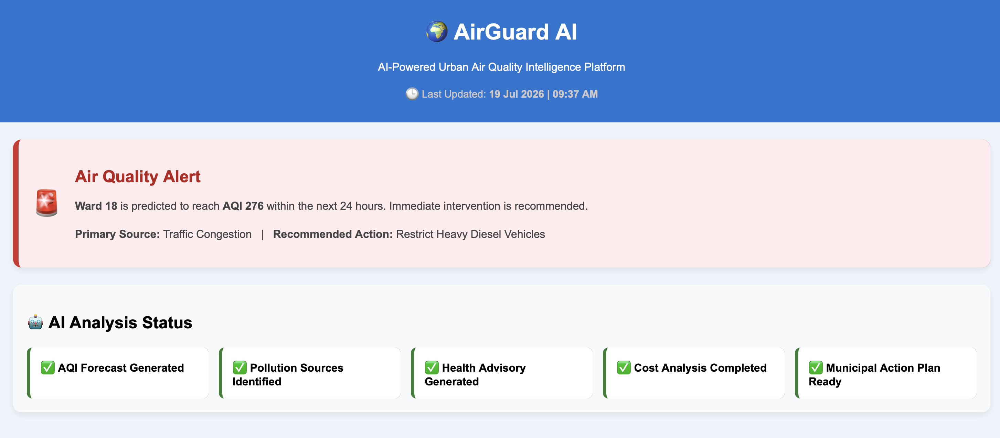
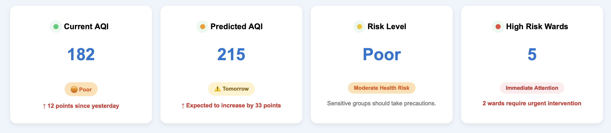
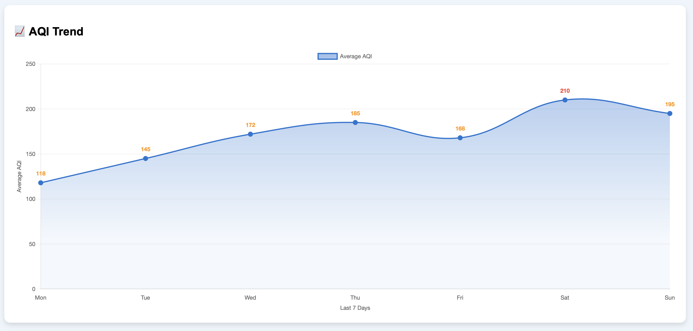
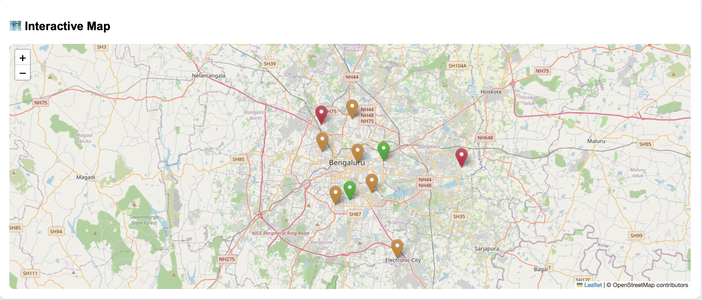
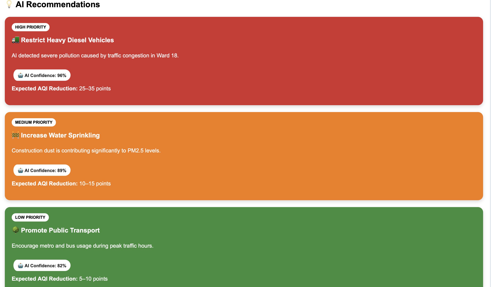
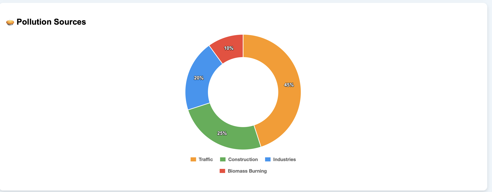
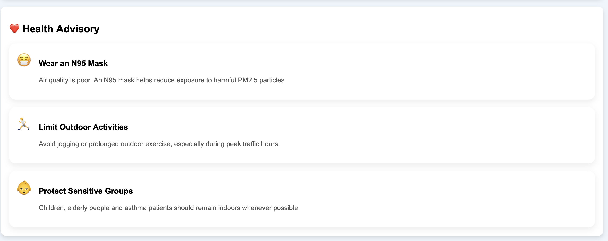
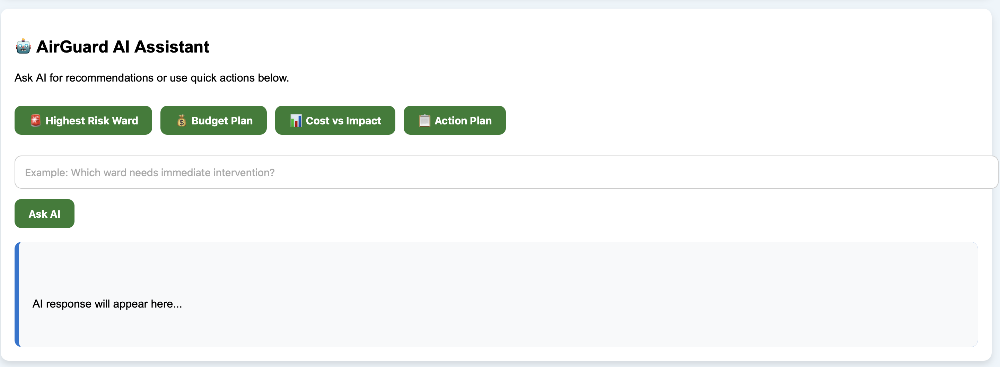

# 🌍 AirGuard AI

> **AI-Powered Urban Air Quality Intelligence Platform**

AirGuard AI is an intelligent web-based platform developed for **ET AI Hackathon 2.0**. It helps municipal authorities monitor urban air quality, predict future AQI levels, identify pollution hotspots, analyze pollution sources, generate AI-powered recommendations, provide health advisories, and support data-driven decision making through an interactive dashboard.

---

# Project Overview

Air pollution is one of the biggest challenges faced by modern cities. Existing monitoring systems mainly provide current AQI values but offer limited support for prediction and decision making.

AirGuard AI combines Machine Learning, Geospatial Visualization, and AI-based insights to help authorities predict pollution trends, identify high-risk areas, understand pollution sources, and recommend effective interventions.

---

# Key Features

- Hyperlocal AQI Prediction
- Ward-wise Air Quality Monitoring
- Interactive Pollution Map
- AQI Trend Visualization
- Pollution Source Analysis
- AI-Based Recommendations
- Health Advisory Generation
- Cost & Impact Analysis
- AI Assistant
- Smart Dashboard

---

# Technology Stack

### Frontend
- HTML5
- CSS3
- JavaScript
- Chart.js
- Leaflet.js

### Backend
- Flask (Python)

### Machine Learning
- Random Forest

### Datasets
- Historical AQI Dataset
- Weather Dataset
- Pollution Source Dataset
- Ward Boundary GeoJSON

---

# Project Structure

```text
AirGuardAI/
│
├── app.py
├── config.py
├── requirements.txt
├── README.md
├── .gitignore
│
├── datasets/
├── models/
├── services/
├── templates/
├── static/
└── assets/
```

---

# User Interface

## Landing Page



---

## Dashboard Header



---

## KPI Dashboard



---

## AQI Trend Analysis



---

## Interactive Pollution Map



---

## Pollution Source Distribution



---

## Doughnut Chart Analysis



---

## Health Advisory



---

## AI Assistant



---

# Installation

Clone the repository

```bash
git clone https://github.com/tanishkagarg2025/AirGuard-AI.git
```

Go to the project folder

```bash
cd AirGuard-AI
```

Install dependencies

```bash
pip install -r requirements.txt
```

Run the application

```bash
python app.py
```

Open your browser and visit

```
http://127.0.0.1:5000
```

---

# Future Scope

- Real-time AQI API integration
- Live weather data support
- Deep Learning based prediction models
- Satellite data integration
- Mobile application
- Automated alert notifications
- Historical trend analytics

---

# Team

Developed for **ET AI Hackathon 2.0**

- **Tanishka Garg**
- **Pranaviha GaneshKumar**

---

# License

This project is developed for educational and hackathon purposes.